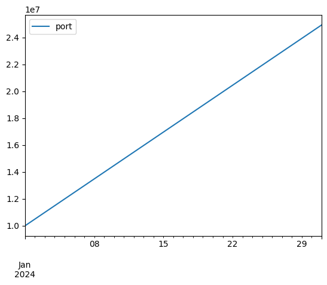

# 回測套件 DIY

要觀看 ```python``` 檔案，[連結在這](Backtest.py)。

前陣子在研究一些自動化交易的的基本理念，在研究出一些結果的時候就蠢蠢欲動，寫出了一個看來可行的策略想要進行回測時，卻發現網路上找到的回測套件確實有，但不知道他們的交易手續費以及交易稅是否符合台灣股市交易所的標準，再說，若是結果出來不準確的話也不知道要怪誰。看了台灣有幾間公司出了 ```python``` 回測套件，挺貼心好用的！但使用上好像只限於單一資產的交易上。若要在一個交易對（Trading Pair）上做測試看總體投資組合上的回報時，他們的套件又不管用了。這時候心裡就浮出一個國中在學校上英文課的話面，當英文老師問同學一個問題，然後同學回答不出來的時候，她就會以一個疲憊的表情嘆氣說「唉，求人不如求己！」然後自己在黑板上寫出答案⋯⋯

本來真的不是很想要自己寫出一整個回測的架構，因為光用想的都覺得他是一個耗費力氣又艱難的事情。畢竟小弟在這個領域也只是個新手，寫 code 能力也不是超級專業。我害怕，花了一堆功夫在它上面後，最終的結果依然不準確，甚至根本無法正常運行。後來在查詢資料的過程中，看到了一些自己寫回測架構的優缺點分析：

優點：
* 他是一個很棒的訓練機會，可以讓自己不管是在 coding 的能力上或是對於股市的了解更上一層樓。
* 所有權，自己寫出來的東西就完全是自己的，自己也最了解這個架構是如何運作的。
* 客製化，自己寫出來的架構可以完全貼合你自己的喜好以及工作流程。

缺點：
* 難。
* 已經有別人做出來的套件了，何必犧牲自己的寶貴時間呢？而且，其實別人的工具也許也可以經過微調後拿來自己使用。
* 需要維護。自己寫出來的系統品質取決於你自己投入的時間與精力。

最後，我還是認了。當回測的結果出來不準確的時候，與其不知道怪誰，不如怪自己！求人不如求己。於是我就捲起袖子，參考著國外的文章教學，埋頭苦幹。[我的參考資源放在這邊](https://mayerkrebs.com/building-a-backtesting-framework-in-python-from-scratch/)，有興趣也可以去看一下。

其實開始之後，發現不是原來想像的這麼難！自己也就花了大概15個小時上下的時間也就完成。我自己的架構跟參考資源的類似，但有些不一樣的關鍵點。當然，第一個版本的功能很陽春，但他有一個紮實的骨架以及模組化的結構，對於以後的更新以及功能開發，我有信心是不難的。

小弟我依照國外的慣例，在這個套件裡使用的的註解算是有標準化，內容用的也是英文，但覺得看英文麻煩的人也不用擔心，這裡會附上中文解說。對於物件導向程式設計（Object Oriented Programming, OOP）不熟的朋友也許需要去研究一下，因為能寫出這個架構完全是需要物件的，逃也逃不掉。

本架構分為兩個主要部分，```Strategy``` 物件透過你的策略負責下單，下單後會傳給 ```Engine``` 物件，而 ```Engine``` 負責回測所需的所有運算以及紀錄現金與部位的更動，若有出現任何問題 ```Engine``` 也應該要跳出提示。粗略的架構是長這樣的。接下來我們就來看一下一些細節。

## 下單 ```Order``` 物件
```Strategy``` 策略物件會依照每一個新的 K 產生 ```Order``` 物件，並存在他自己裡面。目前我的回測架構支援買賣以及融券賣空買回的功能。```ticker``` 可以代表股票編號，```side``` 指的是下單動作，```size``` 是張數，```idx``` 是執行時間，```type``` 是下單的類型，目前只支援市場價，沒有限價或其他比較花俏的下單模式。


```python
""""
Version 1.0
2024-12-18 FJ Hsu 徐晨耀 erichsu5168@gmail.com

*** WARNING: This framework is only for testing purposes only, and I do not claim that it is by any means representative of live-trading. I am not liable for any inaccuracies and misleading results generated. USE AT YOUR OWN RISK. ***

This is a backtest framework written to simulate stock trading on TWSE, transaction fees and tax are tailored to be the same as trading on the Taiwanese stock market. The framework currently supports long (buying and selling) and short (shorting and buying back the short) positions, and all orders are market orders.

Data
Historical data should be prepared beforehand by the user. Currently the framework expects a pandas.Dataframe indexed by Datetime with one price per time period. The price of one asset should be headed by a ticker.
Run the code pasted below to get an idea of data required.
# dates = [pd.to_datetime(f'2024-01-{date}') for date in range(1,32)]
# data = {'stock1':[i*100 for i in range(1, 32)], 'stock2':[i*100 for i in range(31, 0, -1)]}
# df = pd.DataFrame(data, columns=['stock1', 'stock2'], index=dates)
df can then be fed into the engine.
sidenote: If you want to be able to feed OHLC data into the engine, I suggest storing the data in the engine as a dictionary ('ticker': pd.Dataframe) and making a few tweaks to the code

Framework
The framework is comprised of two objects: engine and strategy. An engine is first implemented. After data is fed into the engine, a strategy object can be implemented and fed into the engine. Based on the data for every new period, the strategy implements order objects and stores them, the engine then is responsible for the execution of the orders, keeping track of positions and cash left, and raising warnings. Orders stored in the strategy are deleted after the engine has finished executing, and the process is repeated.

Performance presentation
Market Value of the portfolio, and all positions (with start and end time) throughout the backtest are stored. Currently I have not provided any graphing and ratios in the framework. However, users can easily use their own metrics and build their own forms of presentation from the results of the engine.
"""
import pandas as pd
from tqdm import tqdm

class Order:
    """
    An order is created and stored in the strategy when the strategy executes a 'buy', 'sell', 'short_in' or 'short_out' order. Only market type orders are supported currently.
    :param ticker: ticker symbol of stock
    :param size: Order size. In the Taiwanese market, the convention to trade by units of 1000 shares. Thus, when you enter a 1, in actuality its 1000 shares. size is always positive, you do not need to enter a negative when selling.
    :return: None
    """
    def __init__(self, ticker, size, side, idx, type='market'):
        self.ticker = ticker
        self.size = size
        self.side = side
        self.idx = idx
        self.type = type
```

## 部位 ```Position``` 物件
```Position``` 物件是 ```Engine``` 得到 ```Strategy``` 物件產生的 ```Order``` 物件時在自己裡面產生並存放來記錄部位的物件。```Position``` 比 ```Order``` 多了一些屬性，分別為 ```self.margin``` 來代表融券賣空的保證金，```self.security``` 代表融券賣空的擔保金，```self.active``` 代表本部位是否還存在，以及```self.close_idx``` 代表部位結清的時間點。


```python
class Position:
    """
    Position objects are created and stored in the engine when the engine processes orders from the strategy. Positions keep track of the time they are executed, the time they are closed out, the status of the order (active or closed), the margin (initial cash given to the exchange when entering a short, 90% of the trade in this case), and the security (Sell amount of the short minus fees and tax) are also stored.
    :param ticker: ticker symbol of stock
    :param size: size of the order
    :param side: 'long' or 'short' position
    :param idx: time entering the position
    :return: None
    """
    def __init__(self, ticker, size, side, idx, margin=0, security=0):
        self.ticker = ticker
        self.size = size
        self.side = side
        self.idx = idx
        self.margin = margin
        self.security = security
        self.active  = True
        self.close_idx = None

    def __repr__(self):
        if self.active:
            status = 'active'
        else:
            status = 'closed'
        return f'{self.side} {self.size} shares of {self.ticker} at {self.idx}||Status: {status}'
```

## 策略 ```Strategy``` 物件
像剛剛所說的，策略物件會依照你的策略產生 ```Order``` 物件，並存在自己內部。```Strategy``` 文件裡面有四個「方法」（method），分別為:
 * ```buy()``` 負責產生買單
 * ```sell()``` 負責產生賣單
 * ```short_in()``` 負責產生融券賣單
 * ```short_out()``` 負責產生融券買回
 這些方法產生的 ```Order``` 物件都會存入 ```self.orders``` 裡面。另外，還有一個 ```on_bar()``` 方法，當你在寫自己的策略時會從 ```Strategy``` 物件繼承屬性後寫一個```on_bar()``` 方法內涵你的交易策略然後蓋掉這裡的 ```on_bar()``` 方法。


```python
class Strategy:
    """
    The strategy processes data fed into the engine based on the current bars and creates and stores orders when signals are triggered.
    """
    def __init__(self):
        self.current_idx = None
        self.data = None
        self.orders = []

    def add_data(self, data):
        """
        Adds data to the strategy.
        :param data: data passed to the strategy from the engine.
        :return: None
        """
        self.data = data

    def buy(self, ticker, size=1):
        """
        Creates a buy order and stores it in self.orders.
        :param ticker: stock ticker symbol
        :param size: size of the buy order (in thousands)
        :return: None
        """
        self.orders.append(
            Order(
                ticker = ticker,
                side = 'buy',
                size = size,
                idx = self.current_idx
            )
        )

    def sell(self, ticker, size=1):
        """
        Creates a sell order and stores it in self.orders.
        :param ticker: stock ticker symbol
        :param size: size of the sell order (in thousands)
        :return: None
        """
        self.orders.append(
            Order(
                ticker = ticker,
                side = 'sell',
                size = size,
                idx = self.current_idx
            )
        )

    def short_in(self, ticker, size=1):
        """
        Creates a short order and stores it in self.orders.
        :param ticker: stock ticker symbol
        :param size: size of the short order (in thousands)
        :return: None
        """
        self.orders.append(
            Order(
                ticker = ticker,
                side = 'short_in',
                size = size,
                idx = self.current_idx
            )
        )

    def short_out(self, ticker, size=1):
        """
        Creates a close short order and stores it in self.orders.
        :param ticker: stock ticker symbol
        :param size: size of the order (in thousands)
        :return: None
        """
        self.orders.append(
            Order(
                ticker = ticker,
                side = 'short_out',
                size = size,
                idx = self.current_idx
            )
        )

    def on_bar(self):
        """
        This method will be overridden by your strategy when you create your own strategy that inherits from Strategy.
        :return: None
        """
        pass
```

## 回測引擎 Engine物件
最後，就是最複雜最難搞的引擎物件。他要處理 ```Order```，產生並存入 ```Position``` 然後做計算，還要跳警告。```Engine``` 物件的方法有：
* ```add_data()``` 存入你的股市歷史資料
* ```add_strategy()``` 存入你寫的策略
* ```get_current_price()``` 獲取當前時間點的股價
* ```_process_buy()``` 遇到策略裡有買入單要進行現金計算及部位產生，如果沒有足夠現金會跳出警告並不執行下單
* ```_process_sell()``` 遇到策略裡有賣出訊號會做部位及現金的調整，它同時會檢查有沒有足夠張數可以賣，沒有的話會跳出警告，並且不執行下單
* ```_process_short_in()``` 遇到策略裡有融券賣出單會做相對應的現金調整以及部位產生，若現金不足也會跳出警告並不下單
* ```_process_short_out()``` 遇到策略中的融券買回單會調整相對應的現金及部位，若買回部位不足也會跳警告
* ```_update_max_cash_deployed()```會計算並存入你在回測過程中使用的最大資金
* ```_update_portfolio_mv()```會在每個時間點計算現金加部位的現值並存入 ```self.portfolio_mv```，方便於做策略表現的分析
* ```_check_margin_call()```回檢測融券賣空的部位是否低於融券維持率，是否需要補繳保證金
* ```_fill_orders()``` 彙整前述所有的方法，做出回測中在每一個新的時間點所需要的動作
* ```_run()``` 會啟動整個回測的過程


```python
class Engine:
    """
    The engine takes care of all the calculation in the backtest framework. The engine takes orders created in the strategy and processes them into positions. Positions are then stored in self.positions.
    """
    def __init__(self, initial_cash=1000000):
        self.strategy = None
        self.cash = initial_cash
        self.data = None
        self.current_idx = None
        self.positions = []
        ###
        # These variables can be changed according to your broker
        self.TRADE_FEE = 0.001425 # Transaction fee
        self.TRADE_TAX = 0.003 # Tax incurred when selling stock
        self.BORROW_FEE = 0.001 # Fee to pay when borrowing a stock to short
        ###
        self.portfolio_mv = [initial_cash]
        self.max_cash_deployed = 0

    def add_data(self, data):
        """
        Adds data to the engine.
        :param data: A pd.Dataframe that holds stock prices.
        :return: None
        """
        self.data = data

    def add_strategy(self, strategy):
        """
        Adds a strategy to the engine.
        :param strategy: Strategy object.
        :return: None
        """
        self.strategy = strategy

    def get_current_price(self, ticker):
        """
        Returns the current price of the ticker specified.
        :param ticker: stock ticker symbol
        :return: float, the current price of the ticker.
        """
        return self.data.loc[self.current_idx][ticker]

    def _process_buy(self):
        """
        Processes buy orders. Updates cash and positions. Gives warning if there is insufficient cash and does not execute order.
        :return: None
        """
        for i in self.strategy.orders:
            if i.side == 'buy':
                if self.cash > self.get_current_price(i.ticker)*i.size*1000*(1+self.TRADE_FEE):
                    self.cash -= self.get_current_price(i.ticker)*i.size*1000*(1+self.TRADE_FEE)
                    self.positions.append(
                        Position(
                            ticker = i.ticker,
                            side = 'long',
                            size = i.size,
                            idx = self.current_idx
                        )
                    )
                    print(f'Buy Executed for {i.size} shares of {i.ticker} at {self.current_idx}.')
                else:
                    print(f'Buy Not Executed for {i.size} shares of {i.ticker} at {self.current_idx}: Insufficient Cash.')

    def _process_sell(self):
        """
        Processes sell orders. Checks if there are enough open long positions to close out, if not, it prints a warning and does not execute order. Positions are closed out if they do not meet the size of the order and a later position is processed. If position has a larger size than the order, the position will be closed out and another position is opened with an identical starting time and for the remaining size. Positions closed out will have a closing time stored.
        :return: None
        """
        for sell in [i for i in self.strategy.orders if i.side == 'sell']:
            if sell.size <= sum([i.size for i in self.positions if i.side == 'long' and i.active == True and i.ticker == sell.ticker]):
                print(f'Sell Executed for {sell.size} shares of {sell.ticker} at {self.current_idx}.')
                for position in [i for i in self.positions if i.side == 'long' and i.active == True and i.ticker == sell.ticker]:
                    if position.size < sell.size:
                        position.active = False
                        self.cash += position.size*1000*self.get_current_price(sell.ticker)*(1-self.TRADE_FEE-self.TRADE_TAX)
                        sell.size -= position.size
                        position.close_idx = self.current_idx
                    elif position.size > sell.size:
                        position.active = False
                        position.close_idx = self.current_idx
                        self.cash += sell.size*1000*self.get_current_price(sell.ticker)*(1-self.TRADE_FEE-self.TRADE_TAX)
                        self.positions.append(
                            Position(
                                ticker = sell.ticker,
                                size = position.size-sell.size,
                                side = 'long',
                                idx = position.idx
                            )
                        )
                        sell.size = 0
                    else:
                        position.active = False
                        position.close_idx = self.current_idx
                        self.cash += sell.size*1000*self.get_current_price(sell.ticker)*(1-self.TRADE_FEE-self.TRADE_TAX)
                        sell.size = 0
            else:
                print(f'Sell Not Executed for {sell.size} shares of {sell.ticker} at {self.current_idx}: Insufficient Shares')

    def _process_short_in(self):
        """
        Processes short orders. Checks if there are sufficient funds to execute order (Cash has to be larger than the initial margin), if not, it prints a warning and does not execute order. Margin and security are stored in the position for calculations incurred when the position is closed out.
        :return: None
        """
        for short in [i for i in self.strategy.orders if i.side == 'short_in']:
            margin = short.size*1000*self.get_current_price(short.ticker)*0.9
            if self.cash >= margin:
                security = short.size*1000*self.get_current_price(short.ticker)*(1-self.TRADE_FEE-self.TRADE_TAX-self.BORROW_FEE)
                self.cash -= margin
                self.positions.append(
                    Position(
                        ticker = short.ticker,
                        size = short.size,
                        side = 'short',
                        idx = short.idx,
                        margin = margin,
                        security = security
                    )
                )
                print(f'Short Executed for {short.size} shares of {short.ticker} at {self.current_idx}.')
            else:
                print(f'Short Not Executed for {short.size} shares of {short.ticker} at {self.current_idx}: Insufficient Cash')

    def _process_short_out(self):
        """
        Processes short orders. Checks if there are sufficient shares to execute order, if not, it prints a warning and does not execute order. Positions are closed out if they do not meet the size of the order and a later position is processed. If position has a larger size than the order, the position will be closed out and another position is opened with an identical starting time and for the remaining size. Positions closed out will have a closing time stored.
        :return: None
        """
        for short in [i for i in self.strategy.orders if i.side == 'short_out']:
            if short.size <= sum([i.size for i in self.positions if i.ticker == short.ticker and i.side == 'short' and i.active == True]):
                print(f'Short Closed for {short.size} shares of {short.ticker} at {self.current_idx}.')
                for position in [i for i in self.positions if i.ticker == short.ticker and i.side == 'short' and i.active == True]:
                    if position.size < short.size:
                        position.active = False
                        position.close_idx = self.current_idx
                        buy = position.size*1000*self.get_current_price(position.ticker)*(1+self.TRADE_FEE)
                        interest = (position.margin+position.security)*self.BORROW_FEE*(self.current_idx-position.idx).days/365
                        self.cash = self.cash + position.security - buy + interest + position.deposit
                        short.size -= position.size
                        position.deposit = 0
                        position.security = 0
                    elif position.size > short.size:
                        position.active = False
                        position.close_idx = self.current_idx
                        buy = short.size*1000*self.get_current_price(position.ticker)*(1+self.TRADE_FEE)
                        interest = (position.margin+position.security)*short.size/position.size*self.BORROW_FEE*(self.current_idx-position.idx).days/365
                        self.cash = self.cash + position.security*short.size/position.size - buy + interest + position.deposit*short.size/position.size
                        self.positions.append(
                            Position(
                                ticker = short.ticker,
                                side = 'short',
                                size = position.size - short.size,
                                idx = position.idx,
                                margin = position.margin*(position.size - short.size)/position.size,
                                security = position.security*(position.size - short.size)/position.size
                            )
                        )
                        position.margin = 0
                        position.security = 0
                        short.size = 0
                    else:
                        position.active = False
                        position.close_idx = self.current_idx
                        buy = short.size*1000*self.get_current_price(position.ticker)*(1+self.TRADE_FEE)
                        interest = (position.margin+position.security)*short.size/position.size*self.BORROW_FEE*(self.current_idx-position.idx).days/365
                        self.cash = self.cash + position.security*short.size/position.size - buy + interest + position.margin*short.size/position.size
                        position.margin = 0
                        position.security = 0
                        short.size = 0
            else:
                print(f'Short Not Closed for {short.size} shares of {short.ticker} at {self.current_idx}: Insufficient Shares')

    def _update_max_cash_deployed(self):
        """
        This is to calculate the maximum cash deployed at any single period throughout the backtest. Values are stored in self.max_cash_deployed.
        :return: None
        """
        if self.max_cash_deployed < self.portfolio_mv[0] - self.cash:
            self.max_cash_deployed = self.portfolio_mv[0] - self.cash

    def _update_portfolio_mv(self):
        """
        Portfolio market value is recorded for each bar for ease of performance presentation and stored in self.portfolio_mv. On the current bar, cash and value of each active position if closed out is added and appended to self.portfolio_mv.
        :return: None
        """
        value = self.cash
        for position in [i for i in self.positions if i.active]:
            if position.side == 'long':
                value += position.size*1000*self.get_current_price(position.ticker)*(1-self.TRADE_FEE-self.TRADE_TAX)
            elif position.side == 'short':
                value += position.margin
                value = value + position.security - position.size*1000*self.get_current_price(position.ticker)*(1+self.TRADE_FEE) + (position.margin+position.security)*self.BORROW_FEE*(self.current_idx-position.idx).days/365
        self.portfolio_mv.append(value)

    def _check_margin_call(self):
        """
        In the TWSE, margin calls on short positions are triggered when (margin+security)/(current value of stock) drops below 130%. This method is called on every bar to check if current prices trigger any margin calls. If margin calls are triggered, a warning message is printed.
        :return: None
        """
        for position in [i for i in self.positions if i.active and i.side == 'short']:
            if (position.margin+position.security)/position.size*1000*self.get_current_price(position.ticker) < 1.3:
                print(f'Warning: Margin Call on {position.ticker}')

    def _fill_orders(self):
        """
        This method is called on every bar, and is what the engine does in sequence to process all the calculations and updates needed for the backtest. The sequence of the methods called below are important and will affect the accuracy of the backtest.
        :return: None
        """
        self._check_margin_call() # Margin calls should be checked on new prices before any new orders from the strategy are processed.
        self._process_buy()
        self._process_sell()
        self._process_short_in()
        self._process_short_out()
        self.strategy.orders = [] # Orders in the strategy are cleaned out after they are processed.
        self._update_max_cash_deployed()
        self._update_portfolio_mv()
        self.positions.sort(key = lambda position: position.idx) # Positions are sorted by their initialized date to ensure sell and closing short orders are executed on the oldest active orders first.

    def run(self):
        """
        This method is called when the user has fed the data and strategy to the engine. It is the command that runs the backtest.
        :return: None
        """
        self.strategy.add_data(self.data) # Data in the engine is fed to the strategy
        for idx in tqdm(self.data.index):
            self.current_idx = idx
            self.strategy.current_idx = self.current_idx
            print(idx) # Printing the timestamp on each bar can help us find where problems have occurred in the backtest more efficiently.
            # Run the strategy on the current bar
            self.strategy.on_bar()
            self._fill_orders()
            # If you want your backtest to take positions on the bar after orders have been called, switch the two lines above
```

## 匯入歷史價格的形式
自己目前使用的歷史價格形式是一個 Dataframe 裡面存入每天的收盤價，因此我的架構接受的資料則呈現形式如下。以 Datetime 形式為編序，列名為股票代碼。若是你想要匯入每天的開高收低價，可以講歷史價格存入 dictionary裡面，然後在進行架構相對應的部分做一些微調。也許我會在未來需要使用開高收低價時，做出一個二代版本。


```python
dates = [pd.to_datetime(f'2024-01-{date}') for date in range(1,32)]
data = {'0000':[i*100 for i in range(1, 32)], '9999':[i*100 for i in range(31, 0, -1)]}
df = pd.DataFrame(data, columns=['0000', '9999'], index=dates)
print(df)
```

                0000  9999
    2024-01-01   100  3100
    2024-01-02   200  3000
    2024-01-03   300  2900
    2024-01-04   400  2800
    2024-01-05   500  2700
    2024-01-06   600  2600
    2024-01-07   700  2500
    2024-01-08   800  2400
    2024-01-09   900  2300
    2024-01-10  1000  2200
    2024-01-11  1100  2100
    2024-01-12  1200  2000
    2024-01-13  1300  1900
    2024-01-14  1400  1800
    2024-01-15  1500  1700
    2024-01-16  1600  1600
    2024-01-17  1700  1500
    2024-01-18  1800  1400
    2024-01-19  1900  1300
    2024-01-20  2000  1200
    2024-01-21  2100  1100
    2024-01-22  2200  1000
    2024-01-23  2300   900
    2024-01-24  2400   800
    2024-01-25  2500   700
    2024-01-26  2600   600
    2024-01-27  2700   500
    2024-01-28  2800   400
    2024-01-29  2900   300
    2024-01-30  3000   200
    2024-01-31  3100   100


## 使用範例
以下提供一個簡略的使用範例。在一月1日買入5張 0000，一月31日賣出。我們先構建出一個繼承 ```Strategy``` 的物件叫作 ```SimpleStrat```，並寫一個 ```on_bar()``` 方法內置我們的交易策略。接下來，創造一個 e 為我們今天要用的引擎並指定一千萬的初始資金，匯入歷史資訊，匯入策略，進行回測。


```python
class SimpleStrat(Strategy):
    def on_bar(self):
        if self.current_idx == pd.to_datetime('2024-01-01'):
            self.buy('0000', 5)
        if self.current_idx == pd.to_datetime('2024-01-31'):
            self.sell('0000',5)

e = Engine(initial_cash=10000000)
e.add_data(df)
e.add_strategy(SimpleStrat())
e.run()
```

    100%|██████████| 31/31 [00:00<00:00, 2343.14it/s]

    2024-01-01 00:00:00
    Buy Executed for 5 shares of 0000 at 2024-01-01 00:00:00.
    2024-01-02 00:00:00
    2024-01-03 00:00:00
    2024-01-04 00:00:00
    2024-01-05 00:00:00
    2024-01-06 00:00:00
    2024-01-07 00:00:00
    2024-01-08 00:00:00
    2024-01-09 00:00:00
    2024-01-10 00:00:00
    2024-01-11 00:00:00
    2024-01-12 00:00:00
    2024-01-13 00:00:00
    2024-01-14 00:00:00
    2024-01-15 00:00:00
    2024-01-16 00:00:00
    2024-01-17 00:00:00
    2024-01-18 00:00:00
    2024-01-19 00:00:00
    2024-01-20 00:00:00
    2024-01-21 00:00:00
    2024-01-22 00:00:00
    2024-01-23 00:00:00
    2024-01-24 00:00:00
    2024-01-25 00:00:00
    2024-01-26 00:00:00
    2024-01-27 00:00:00
    2024-01-28 00:00:00
    2024-01-29 00:00:00
    2024-01-30 00:00:00
    2024-01-31 00:00:00
    Sell Executed for 5 shares of 0000 at 2024-01-31 00:00:00.


    


引擎會印出每個被處理過的日期。之所以印出日期是因為如果引擎有偵測的任何問題並且要跳出警告，我們可以在發生問題的日期下面看到警告。就可以有效率的知道問題發生在哪裏了。

我們可以來看一下回測結果。回測結束後的資金：


```python
print(e.cash)
```

    24930700.0


我們本交易使用的資金。


```python
print(e.max_cash_deployed)
```

    500712.5


本交易所生成的部位紀錄。部位已關閉。


```python
print(e.positions)
```

    [long 5 shares of 0000 at 2024-01-01 00:00:00||Status: closed]


回測期間的資產現值。


```python
df_result = df
df_result['port'] = e.portfolio_mv[1:]
df_result.plot.line(y='port')
```


    <Axes: >


    

    


可以自己也算算看，是否與實際的結果相符。

為了不讓這篇文章太冗長，對於回測的使用案例就提到這邊。基本上所有的下單方法都是一樣的，重點是在使用者的策略，使用方法，以及績效呈現方式上。而這些部分，就讓讀者自由發揮。在未來，我可能會加上其他下單類別以及條件的功能，以及內建策略績效的圖表呈現。當然，我更推薦的是如果讀者有一些自己的時間，甚至可以去建構出屬於自己的一份回測軟體，不僅增進對市場的瞭解，也更是對於自己的需求是一個最佳的客製化選擇。
