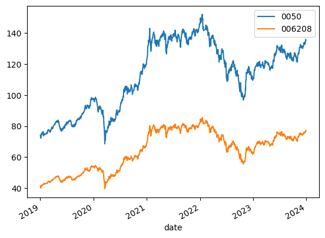
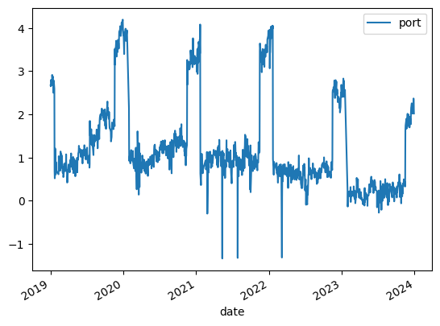
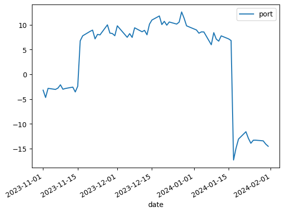
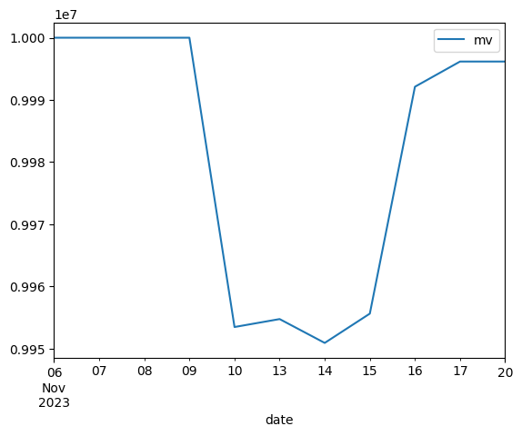
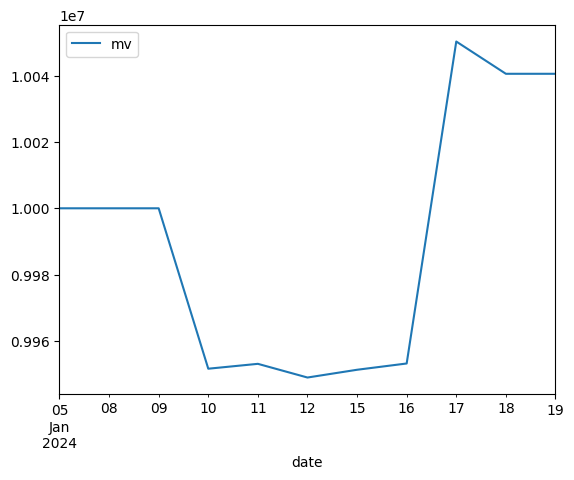
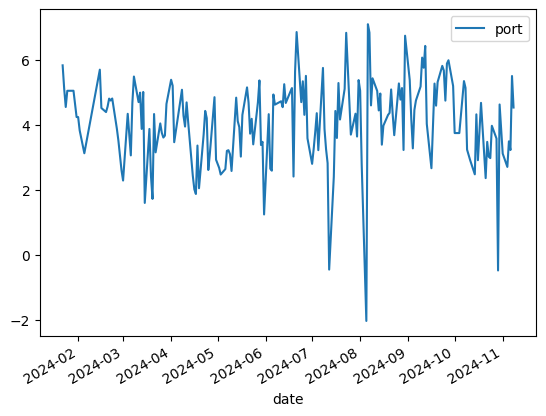
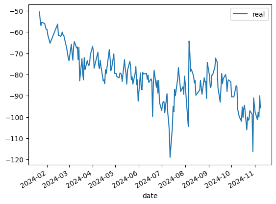
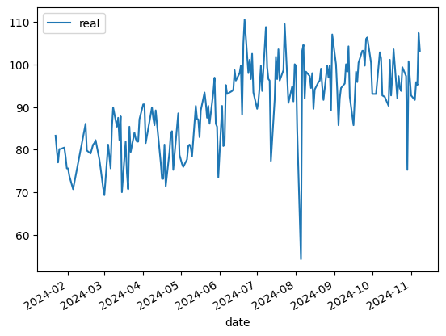
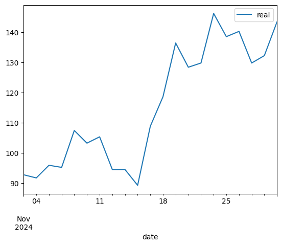
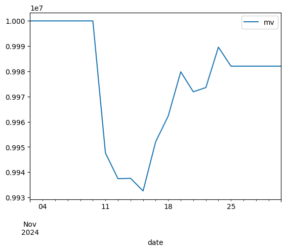

# 一個均值回歸的小插曲

2024-12-27 FJ

在我的文章系列裡，關於均值回歸的「教科書性質」主題裡計畫裡還有布林通道（Bollinger Bands）以及卡爾曼濾波（Kalman Filter）。但在寫這兩篇文章之前，自己在學習的路程上遇到了一些障礙。首先，是缺乏一個可靠的回測套件。這個問題已經在上一篇文章解決，我自己寫了一個回測架構。但接下來，在使用我的回測套件做一些初步測試時，發現僅僅找到協整性強的兩個資產，並無法代表換來收益。在這篇文章中，就來給大家看一下在這個問題上的心路歷程。我相信在失敗的例子中，也能找得到學習成長的機會。

這個故事的開端，發生在我寫第三篇文章：協整關係時尋找兩個台股ETF來當協整的例子。當時嘗試著抓2019年初至2023年底，兩個ETF的資料。我碰巧找到了0050（元大台灣50）與006208（富邦台灣50）這兩個走勢。


```python
from fugle_marketdata import RestClient
import pandas as pd

client = RestClient(api_key = api_key.key) # api_key.key 填入你的富果 RestAPI 鑰匙（api_key = '你的鑰匙')
stock = client.stock

def get_data(symbol, year):
    s = stock.historical.candles(**{"symbol": symbol,
                                  "from": f"{year}-01-01",
                                  "to": f"{year}-12-31",
                                  "fields": "close",
                                  'sort': 'asc'})
    f = pd.DataFrame.from_dict(s['data'])
    f['date'] = pd.to_datetime(f['date'])
    f.set_index('date', inplace=True)
    f.rename(columns={'close':f'{symbol}'}, inplace=True)
    return f

s50 = '0050'
s6208 = '006208'

df50_19 = get_data(s50, '2019')
df50_20 = get_data(s50, '2020')
df50_21 = get_data(s50, '2021')
df50_22 = get_data(s50, '2022')
df50_23 = get_data(s50, '2023')

df6208_19 = get_data(s6208, '2019')
df6208_20 = get_data(s6208, '2020')
df6208_21 = get_data(s6208, '2021')
df6208_22 = get_data(s6208, '2022')
df6208_23 = get_data(s6208, '2023')

df50 = pd.concat([df50_19, df50_20, df50_21, df50_22, df50_23])
df6208 = pd.concat([df6208_19, df6208_20, df6208_21, df6208_22, df6208_23])
df = pd.merge(df50, df6208, on='date', how='inner')
```

圖表上看起來，他們確實是有協整性的兩個走勢。


```python
df.plot()
```

    /Users/varltia/PycharmProjects/algo_trading/.venv/lib/python3.12/site-packages/pandas/plotting/_matplotlib/core.py:981: UserWarning: This axis already has a converter set and is updating to a potentially incompatible converter
      return ax.plot(*args, **kwds)


    <Axes: xlabel='date'>


    

    


我們用 Johansen Test 也可以確認他們的協整關係。


```python
from statsmodels.tsa.vector_ar.vecm import coint_johansen

results_johansen = coint_johansen(df, 0, 1)
print(results_johansen.trace_stat)
print(results_johansen.trace_stat_crit_vals)
print(results_johansen.max_eig_stat)
print(results_johansen.max_eig_stat_crit_vals)
```

    [28.41637884  2.45404418]
    [[13.4294 15.4943 19.9349]
     [ 2.7055  3.8415  6.6349]]
    [25.96233466  2.45404418]
    [[12.2971 14.2639 18.52  ]
     [ 2.7055  3.8415  6.6349]]


```python
print(results_johansen.eig)
print(results_johansen.evec)
```

    [0.02115872 0.00201941]
    [[ 0.90184091 -0.09029308]
     [-1.55716578  0.0764544 ]]


做完Johansen Test看到Hedge Ratio組合出來的走勢時，像是臉上被賞了一個巴掌一樣。這個走勢太好預測了吧！撇除他明顯的均值回歸性，我們還可以同時看到每年年底年初甚至會有一個劇烈且明顯的價格變動。這個變動的原因沒有深入去研究，但我猜是多個公司在年底為了做出好看的結算而在市場中造成的訂價誤差。無論如何，我們只要持有著測試中所得到的避險比率，等著這個波動的出現與消失，一年一次來回賺一趟，風險極低，獲利又穩定，對吧？！對吧⋯⋯？

當下的我心臟跳得好快。難道，我已經找到了財務自由的鑰匙了嗎？簡單解答一下：完全沒有。想多了。但當時天真的我還沒寫出來我的回測套件，因此沉住氣花了幾天的時間寫出來後，就回來測試這個策略的可行性。


```python
df_results = df.copy()
df_results['port'] = 0.90184091*df_results['0050'] -1.55716578*df_results['006208']
df_results.plot.line(y='port')
```


    <Axes: xlabel='date'>


    

    


我補上了2024年的歷史收盤價，然後為了避免前瞻性偏差，拿2023年期間資產組合價格尚未有大變動的區間去做了 Johansen Test。得到了很優秀的協整性表現後，拿了避險比率再做了一次2023年底以及2024年初預計做的資產組合。


```python
s50_24 = stock.historical.candles(**{"symbol": '0050',
                                  "from": "2024-01-01",
                                  "to": "2024-12-24",
                                  "fields": "close",
                                  'sort': 'asc'})
s6208_24 = stock.historical.candles(**{"symbol": '006208',
                                  "from": "2024-01-01",
                                  "to": "2024-12-24",
                                  "fields": "close",
                                  'sort': 'asc'})
f50_24 = pd.DataFrame.from_dict(s50_24['data'])
f6208_24 = pd.DataFrame.from_dict(s6208_24['data'])
f50_24['date'] = pd.to_datetime(f50_24['date'])
f6208_24['date'] = pd.to_datetime(f6208_24['date'])
f50_24.set_index('date', inplace=True)
f6208_24.set_index('date', inplace=True)
f50_24.rename(columns={'close':'0050'}, inplace=True)
f6208_24.rename(columns={'close':'006208'}, inplace=True)
df24 = pd.merge(f50_24, f6208_24, on='date', how='inner')
df = pd.concat([df, df24])
sample = df.loc[pd.to_datetime('2023-02-01'):pd.to_datetime('2023-10-31')].copy()
sample_johansen = coint_johansen(sample, 0, 1)
print(sample_johansen.trace_stat)
print(sample_johansen.trace_stat_crit_vals)
print(sample_johansen.max_eig_stat)
print(sample_johansen.max_eig_stat_crit_vals)
print(sample_johansen.eig)
print(sample_johansen.evec)
```

    [39.25592677  3.24500944]
    [[13.4294 15.4943 19.9349]
     [ 2.7055  3.8415  6.6349]]
    [36.01091732  3.24500944]
    [[12.2971 14.2639 18.52  ]
     [ 2.7055  3.8415  6.6349]]
    [0.18041351 0.01776847]
    [[  7.23121448  -0.91440071]
     [-12.56886649   2.01221624]]


使用這個避險組合比率在我們預計要做進出市場的時間範圍，可以看的這個價格波動依然存在。且回去看過去的歷史紀錄，可以發現資產組合的價值突升往往會發生在11月中旬，價值的突降往往會發生在一月中旬。


```python
test = df.loc[pd.to_datetime('2023-11-01'):pd.to_datetime('2024-01-31')].copy()
test['port'] = 7.23121448*test['0050'] - 12.56886649*test['006208']
test.plot.line(y='port')
```


    <Axes: xlabel='date'>


    

    


使用回測套件，在11月10號買進 $7.23121448\times4=28.92\approx29$ 張 ```0050```，以及融券賣空 $12.56886649\times4=50.28\approx50$ 張 ```006208``` 然後在11月17號結清部位。


```python
from Backtest import *

class NYA(Strategy):
    def on_bar(self):
        if self.current_idx == pd.to_datetime('2023-11-10'):
            self.buy('0050', 29)
            self.short_in('006208', 50)
        elif self.current_idx == pd.to_datetime('2023-11-17'):
            self.sell('0050', 29)
            self.short_out('006208', 50)

e = Engine(initial_cash=10000000)
e.add_data(test)
e.add_strategy(NYA())
e.run()
```

    100%|██████████| 65/65 [00:00<00:00, 2837.20it/s]

    2023-11-01 00:00:00
    2023-11-02 00:00:00
    2023-11-03 00:00:00
    2023-11-06 00:00:00
    2023-11-07 00:00:00
    2023-11-08 00:00:00
    2023-11-09 00:00:00
    2023-11-10 00:00:00
    Buy Executed for 29 shares of 0050 at 2023-11-10 00:00:00.
    Short Executed for 50 shares of 006208 at 2023-11-10 00:00:00.
    2023-11-13 00:00:00
    2023-11-14 00:00:00
    2023-11-15 00:00:00
    2023-11-16 00:00:00
    2023-11-17 00:00:00
    Sell Executed for 29 shares of 0050 at 2023-11-17 00:00:00.
    Short Closed for 50 shares of 006208 at 2023-11-17 00:00:00.
    2023-11-20 00:00:00
    2023-11-21 00:00:00
    2023-11-22 00:00:00
    2023-11-23 00:00:00
    2023-11-24 00:00:00
    2023-11-27 00:00:00
    2023-11-28 00:00:00
    2023-11-29 00:00:00
    2023-11-30 00:00:00
    2023-12-01 00:00:00
    2023-12-04 00:00:00
    2023-12-05 00:00:00
    2023-12-06 00:00:00
    2023-12-07 00:00:00
    2023-12-08 00:00:00
    2023-12-11 00:00:00
    2023-12-12 00:00:00
    2023-12-13 00:00:00
    2023-12-14 00:00:00
    2023-12-15 00:00:00
    2023-12-18 00:00:00
    2023-12-19 00:00:00
    2023-12-20 00:00:00
    2023-12-21 00:00:00
    2023-12-22 00:00:00
    2023-12-25 00:00:00
    2023-12-26 00:00:00
    2023-12-27 00:00:00
    2023-12-28 00:00:00
    2023-12-29 00:00:00
    2024-01-02 00:00:00
    2024-01-03 00:00:00
    2024-01-04 00:00:00
    2024-01-05 00:00:00
    2024-01-08 00:00:00
    2024-01-09 00:00:00
    2024-01-10 00:00:00
    2024-01-11 00:00:00
    2024-01-12 00:00:00
    2024-01-15 00:00:00
    2024-01-16 00:00:00
    2024-01-17 00:00:00
    2024-01-18 00:00:00
    2024-01-19 00:00:00
    2024-01-22 00:00:00
    2024-01-23 00:00:00
    2024-01-24 00:00:00
    2024-01-25 00:00:00
    2024-01-26 00:00:00
    2024-01-29 00:00:00
    2024-01-30 00:00:00
    2024-01-31 00:00:00


    


```python
test['mv'] = e.portfolio_mv[1:]
test.loc[pd.to_datetime('2023-11-05'):pd.to_datetime('2023-11-20')].plot.line(y='mv')
```


    <Axes: xlabel='date'>


    

    


```python
print((e.cash-10000000)/e.max_cash_deployed)
```


    -0.0005497841771141391


```python
print(e.max_cash_deployed)
```

    6972737.94375


從結果中發現，這筆交易用最大投入資金來算，收益是-0.05%。我不信邪，再來用用看2024年初的這段一樣做回測。


```python
class NYA(Strategy):
    def on_bar(self):
        if self.current_idx == pd.to_datetime('2024-01-10'):
            self.short_in('0050', 29)
            self.buy('006208', 50)
        elif self.current_idx == pd.to_datetime('2024-01-18'):
            self.short_out('0050', 29)
            self.sell('006208', 50)

e = Engine(initial_cash=10000000)
e.add_data(test)
e.add_strategy(NYA())
e.run()
```

    100%|██████████| 65/65 [00:00<00:00, 2464.27it/s]

    2023-11-01 00:00:00
    2023-11-02 00:00:00
    2023-11-03 00:00:00
    2023-11-06 00:00:00
    2023-11-07 00:00:00
    2023-11-08 00:00:00
    2023-11-09 00:00:00
    2023-11-10 00:00:00
    2023-11-13 00:00:00
    2023-11-14 00:00:00
    2023-11-15 00:00:00
    2023-11-16 00:00:00
    2023-11-17 00:00:00
    2023-11-20 00:00:00
    2023-11-21 00:00:00
    2023-11-22 00:00:00
    2023-11-23 00:00:00
    2023-11-24 00:00:00
    2023-11-27 00:00:00
    2023-11-28 00:00:00
    2023-11-29 00:00:00
    2023-11-30 00:00:00
    2023-12-01 00:00:00
    2023-12-04 00:00:00
    2023-12-05 00:00:00
    2023-12-06 00:00:00
    2023-12-07 00:00:00
    2023-12-08 00:00:00
    2023-12-11 00:00:00
    2023-12-12 00:00:00
    2023-12-13 00:00:00
    2023-12-14 00:00:00
    2023-12-15 00:00:00
    2023-12-18 00:00:00
    2023-12-19 00:00:00
    2023-12-20 00:00:00
    2023-12-21 00:00:00
    2023-12-22 00:00:00
    2023-12-25 00:00:00
    2023-12-26 00:00:00
    2023-12-27 00:00:00
    2023-12-28 00:00:00
    2023-12-29 00:00:00
    2024-01-02 00:00:00
    2024-01-03 00:00:00
    2024-01-04 00:00:00
    2024-01-05 00:00:00
    2024-01-08 00:00:00
    2024-01-09 00:00:00
    2024-01-10 00:00:00
    Buy Executed for 50 shares of 006208 at 2024-01-10 00:00:00.
    Short Executed for 29 shares of 0050 at 2024-01-10 00:00:00.
    2024-01-11 00:00:00
    2024-01-12 00:00:00
    2024-01-15 00:00:00
    2024-01-16 00:00:00
    2024-01-17 00:00:00
    2024-01-18 00:00:00
    Sell Executed for 50 shares of 006208 at 2024-01-18 00:00:00.
    Short Closed for 29 shares of 0050 at 2024-01-18 00:00:00.
    2024-01-19 00:00:00
    2024-01-22 00:00:00
    2024-01-23 00:00:00
    2024-01-24 00:00:00
    2024-01-25 00:00:00
    2024-01-26 00:00:00
    2024-01-29 00:00:00
    2024-01-30 00:00:00
    2024-01-31 00:00:00


    


```python
test['mv'] = e.portfolio_mv[1:]
test.loc[pd.to_datetime('2024-01-05'):pd.to_datetime('2024-01-20')].plot.line(y='mv')
```


    <Axes: xlabel='date'>


    

    


```python
print((e.cash-10000000)/e.max_cash_deployed)
```

    0.005606277543014242


```python
print(e.max_cash_deployed)
```

    7235912.9375


做的交易是反向的。2024年1月10號融券賣空29張 ```0050``` 並買進50張 ```006208```，到了1月18日再結清部位。這次的結果來看，收益大約是0.56%，同樣也不高。這兩段來回的測試告訴我們，做一次這樣的交易成本，包含交易手續費以及交易稅，大約會占我們交易額的0.5%至1%之間。同時因為交易所需的資本包含買入的全部資金以及融券賣空的90%資金，這個策略的收益相較於投資資本是不大的。投資組合的價格波動幅度也無法保證每次的進出可以支撐我們交易中所需的成本。

另外，也得針對完美避險比率以及現實中的買賣最小單位問題作討論。零股是目前在台灣是無法進行融券以及借券賣出。因此我們在做這種策略的討論時，只能以張為最小單位進行交易。一個完美的避險比率在經過轉換成為整數部位時，只要誤差太大就會失去避險的功能。我們用2024年年底的案例來看。


```python
sample_24 = df.loc[pd.to_datetime('2024-01-20'):pd.to_datetime('2024-11-10')].copy()
sample_24_johansen = coint_johansen(sample_24, 0, 1)
print(sample_24_johansen.trace_stat)
print(sample_24_johansen.trace_stat_crit_vals)
print(sample_24_johansen.max_eig_stat)
print(sample_24_johansen.max_eig_stat_crit_vals)
print(sample_24_johansen.eig)
print(sample_24_johansen.evec)
```

    [52.82170747  2.5963324 ]
    [[13.4294 15.4943 19.9349]
     [ 2.7055  3.8415  6.6349]]
    [50.22537508  2.5963324 ]
    [[12.2971 14.2639 18.52  ]
     [ 2.7055  3.8415  6.6349]]
    [0.23336366 0.01364328]
    [[ 4.13517416 -0.02864643]
     [-7.02752198  0.14461636]]


以下是用完美避險比例配置出的資產分配。


```python
sample_24['port'] = 4.13517416*sample_24['0050'] -7.02752198*sample_24['006208']
sample_24.plot.line(y='port')
```


    <Axes: xlabel='date'>


    

    


若是以20:-35的比例去做配置，會發現我們的投資組合價值出現持續下跌的情況。


```python
sample_24['real'] = 20*sample_24['0050'] -35*sample_24['006208']
sample_24.plot.line(y='real')
```


    <Axes: xlabel='date'>


    

    


若以21:-35的比率去做配置，會發現走勢依然不完全與原來的完美配置相同，但好像會比上一個好一些。


```python
sample_24['real'] = 21*sample_24['0050'] -35*sample_24['006208']
sample_24.plot.line(y='real')
```


    <Axes: xlabel='date'>


    

    


找到一個比較可行的避險比率後，來看看若是就在我寫這篇文章前的一個多月來執行這個策略的結果會是什麼。


```python
class NYA(Strategy):
    def on_bar(self):
        if self.current_idx == pd.to_datetime('2024-11-11'):
            self.buy('0050', 21)
            self.short_in('006208', 35)
        elif self.current_idx == pd.to_datetime('2024-11-25'):
            self.sell('0050', 21)
            self.short_out('006208', 35)

test_24 = df.loc[pd.to_datetime('2024-11-01'):pd.to_datetime('2024-11-30')].copy()

e = Engine(initial_cash=10000000)
e.add_data(test_24)
e.add_strategy(NYA())
e.run()
```

    100%|██████████| 21/21 [00:00<00:00, 3295.31it/s]

    2024-11-01 00:00:00
    2024-11-04 00:00:00
    2024-11-05 00:00:00
    2024-11-06 00:00:00
    2024-11-07 00:00:00
    2024-11-08 00:00:00
    2024-11-11 00:00:00
    Buy Executed for 21 shares of 0050 at 2024-11-11 00:00:00.
    Short Executed for 35 shares of 006208 at 2024-11-11 00:00:00.
    2024-11-12 00:00:00
    2024-11-13 00:00:00
    2024-11-14 00:00:00
    2024-11-15 00:00:00
    2024-11-18 00:00:00
    2024-11-19 00:00:00
    2024-11-20 00:00:00
    2024-11-21 00:00:00
    2024-11-22 00:00:00
    2024-11-25 00:00:00
    Sell Executed for 21 shares of 0050 at 2024-11-25 00:00:00.
    Short Closed for 35 shares of 006208 at 2024-11-25 00:00:00.
    2024-11-26 00:00:00
    2024-11-27 00:00:00
    2024-11-28 00:00:00
    2024-11-29 00:00:00


    


這是我們避險比率配置出來在波動期間的走勢。


```python
test_24['real'] = 21*test_24['0050'] - 35*test_24['006208']
test_24.plot.line(y='real')
```


    <Axes: xlabel='date'>


    

    


這是我們的總資產價值。最後，還是賠錢了。收益是-0.2%。


```python
test_24['mv'] = e.portfolio_mv[1:]
test_24.plot.line(y='mv')
```


    <Axes: xlabel='date'>


    

    


```python
(e.cash-10000000)/e.max_cash_deployed
```


    -0.002285804180019507


經過了這番討論，我們可以得出幾個重要的結論。在台灣的高交易成本的環境中，手續費以及交易稅會成為決定策略是否有效的重要門檻。在我過去的文章中，以及這一篇文章裡，找到有均值回歸特性的單一資產，或是有協整性值的交易組合並不是太難。但即使這些序列的均值回歸性極強、預測性極高，但是只要它們的波動不夠大，在上面依然是不好圖利的。在今天的案例中，即使看似這麼明顯的波動都沒有辦法確認正收益的情況下，那麼平時資產組合的均值偏離就更沒有辦法圖利了，一次次的交易反而是一次次的損失。

那怎麼辦呢？學了這麼多，投資了自己這麼多時間卻發現好像撲空了？我也覺得不一定。如果最大的障礙是交易成本的話，也許本來在台灣股市會讓我們荷包穩定扣血的策略轉移到美國的交易所上反而變成了印鈔機。或許，台股中也是找得到波動幅度大卻仍有均值回歸性都序列，畢竟這兩個特徵也不是互相排斥的。接下來，我會去研究一下如何用布林通道去在均值回歸序列上做交易。另外，卡爾曼濾波可以讓我們用動態的避險比率去克服協整性不是極高的交易對，給我們在交易標的上增添了更多的可能性。

