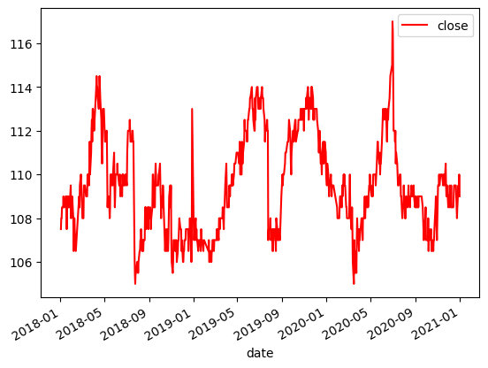
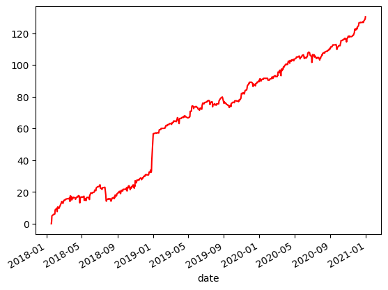

# 穩定過程與均值回歸 Mean-Reverting / Stationary Time Series || 使用 Fugle RestAPI 抓取歷史行情

參考文章：[Ernie Chan | Algorithmic Trading: Winning Strategies and Their Rationale, Chapter 2](https://www.google.com/search?gs_ssp=eJzj4tFP1zfMSDfJKDY1KzZg9JJLLcrLTFVIzkjMU0jMSc8vyizJyM1MVigpSkzJzEsHAFyvD-s&q=ernie+chan+algorithmic+trading&rlz=1C5CHFA_enTW990TW990&oq=ernie+chan+&gs_lcrp=EgZjaHJvbWUqBwgCEC4YgAQyBggAEEUYOzIHCAEQLhiABDIHCAIQLhiABDIGCAMQRRg5MgcIBBAAGIAEMgcIBRAAGIAEMgcIBhAAGIAEMgcIBxAuGIAEMgcICBAAGIAE0gEJMTQ4NTVqMGo3qAIAsAIA&sourceid=chrome&ie=UTF-8)<br>

時間序列的均值回歸（Mean-Reversion）或穩定過程（Stationary）是指該序列隨時間回到其歷史平均值的傾向。這種特性使時間序列對於自動化交易策略而言更具可預測性。然而，市場上很少有單一資產能持續展現這種形式。我們稍後會在書中學到，有許多兩個以上的資產組合起來後具有協整關係（Cointegration），這意味著雖然個別資產價格序列不是穩定過程或均值回歸的，但它們的線性組合是一個均值回歸序列。因此，能夠判斷時間序列是否是穩定過程或具均值回歸的能力仍然非常重要。<br>

均值回歸與穩定過程是同一價格序列特徵的兩種描述方法，但這兩種形容方式出自於兩種不同的檢驗方法。均值回歸時間序列的數學定義是下一期變動是均價與當前價格之間的差異成正比，我們會用 ADF 測試（ADF test）去檢驗是否推翻虛無假設。穩定性價格序列的數學定義是序列的方差增長速度慢於幾何隨機漫步（Geometric Brownian Motion）的增長速度。也就是說，其方差是時間的次線性函數，而幾何隨機漫步的方差則是線性函數，我們會用 Hurst exponent test 去檢驗。<br>
[ADF Test](https://en.wikipedia.org/wiki/Augmented_Dickey%E2%80%93Fuller_test)<br>
[Hurst Exponent Test](https://en.wikipedia.org/wiki/Hurst_exponent)<br>

### 看不懂嗎？不要驚慌，這很正常！

反正只要知道，我們分別用這兩個檢驗，可以去判定序列是否有均值回歸／穩定過程的特性。以下提供實際案例。


電信業一向都是現金股利穩定持續輸出成熟產業，股價相當穩定。尤其中華電信，是許多國民用來存股的對象。我想測試它的股價是否曾出現過穩定過程／均值回歸的特徵。

首先，從富果 Rest API 獲取中華電信（2412）2018至2020年的歷史每日收盤價。因為一次最多只能叫到區間為一年的歷史資料，要叫三次。


```python
from fugle_marketdata import RestClient

client = RestClient(api_key = api_key.key) # api_key.key 填入你的富果 RestAPI 鑰匙（api_key = '你的鑰匙')
stock = client.stock

# Import Data from RestAPI
y18 = stock.historical.candles(**{"symbol": "2412",
                                  "from": "2018-01-01",
                                  "to": "2018-12-31",
                                  "fields": "close",
                                  'sort': 'asc'})
y19 = stock.historical.candles(**{"symbol": "2412",
                                  "from": "2019-01-01",
                                  "to": "2019-12-31",
                                  "fields": "close",
                                  'sort': 'asc'})
y20 = stock.historical.candles(**{"symbol": "2412",
                                  "from": "2020-01-01",
                                  "to": "2020-12-31",
                                  "fields": "close",
                                  'sort': 'asc'})
```


使用 pandas 套件整理成整齊的 dataframe


```python
# Consolidating Data
import pandas as pd
df18 = pd.DataFrame.from_dict(y18['data'])
df19 = pd.DataFrame.from_dict(y19['data'])
df20 = pd.DataFrame.from_dict(y20['data'])

df18_20 = pd.concat([df18, df19, df20], ignore_index=True)
df18_20['date'] = pd.to_datetime(df18_20['date'])
df18_20.set_index('date', inplace=True)
```


我們就有整齊的時間序列了。

先來看個圖表。


```python
# Plot Closing Prices
df18_20.plot(kind='line',color='red')
```


    <Axes: xlabel='date'>


    

    


圖表的部分看起來挺有機會是穩定過程的。


## ADF Test for Mean-Reversion

Python 的```statsmodels```套件有 ```adfuller()```就是ADF測試方便使用。[它的說明文件在這。](https://www.statsmodels.org/dev/generated/statsmodels.tsa.stattools.adfuller.html)


```python
prices = df18_20['close'].to_list()

# Perform ADF test
from statsmodels.tsa.stattools import adfuller
adfuller(prices)
```


    (-3.346606492705209,
     0.012919430208894656,
     3,
     730,
     {'1%': -3.4393396487377155,
      '5%': -2.865507363200066,
      '10%': -2.5688826684180897},
     1641.4849294886808)


結果出來第一個數字是測驗數值，越小越好；第二個數字測驗數值的機率值，一樣是越小越好。我們可以看到測驗數值小於下面5%的數值但大於1%的數值，這代表我們可以以95%的信任拒絕虛無假設。總結：ADF測試的結果下，中華電信在2018-2020年的時候有顯著的平均回歸特徵。

## Hurst Exponent and Variance Ratio Test

Hurst Exponent 較不普遍，但在 python 仍有```hurst```套件的```compute_Hc```可以使用。[它的說明文件在這。](https://pypi.org/project/hurst/)


```python
# Compute Hurst Exponent
from hurst import compute_Hc
H, c, data = compute_Hc(prices, kind='price', simplified=True)
print("H = {:.4f}, c = {:.4f}".format(H,c))
```

    H = 0.3682, c = 1.5651


H 的值只要小於0.5，就有穩定過程的特徵，越小越好。在這裡，測驗數值也出現了穩定過程的指示。

單純計算 Hurst Exponent 沒有顯著性指標，因此會用 Variance Ratio Test 來得到一個特徵值的顯著性。Variance Ratio Test 是看一個價格變動的方差的c倍數是否等於過去c個價格變動的方差，測驗機率值（P-value）越接近0越好。[它的說明文件在這。](https://arch.readthedocs.io/en/latest/unitroot/generated/arch.unitroot.VarianceRatio.html#)


```python
# variance ratio test
import numpy as np
from arch.unitroot import VarianceRatio
vr = VarianceRatio(np.log(prices), 30)
print(vr.summary().as_text())
```

         Variance-Ratio Test Results     
    =====================================
    Test Statistic                 -2.105
    P-value                         0.035
    Lags                               30
    -------------------------------------
    
    Computed with overlapping blocks (de-biased)


這裡c數值我選擇用30，視為一天與一個月方差的比較，P-value為0.035代表我能以96.5%的信心拒絕虛無假設，此時間序列高機率不是一個隨機漫步。（他是個穩定過程。）因此，我們更能確認中華電信在2018至2020之間是有穩定過程／均值回歸的表現。

## Half Life of Mean-Reversion 均值回歸的半衰期

其實一個時間序列的均值回歸性不需要很強，我們依然可以從其中圖利。我們可以用普通最小平方法（OLS）在每日價格變化量 $y(t)-y(t-1)$ 在前一天價格上 $y(t-1)$ 做回歸取得回歸係數。這個回歸係數若是有負號，我們就可以考慮用均值回歸交易策略進行交易。同事他如果有負號但很接近0，他所需要回歸到均值的時間可能需要很久。我們可以透過回歸係數計算出一個均值回歸半衰期。半衰期可以讓我們估計策略完成一次買賣的所需時間，也可以告訴我們策略中用來計算移動平均的回顧期要多長（通常會設定為半衰期的幾倍數）。我們這裡就來計算一下回歸係數以及半衰期。

用```statmodels```做回歸。[它的說明文件在這。](https://www.statsmodels.org/dev/examples/notebooks/generated/ols.html#OLS-estimation)回歸係數為：


```python
d_prices = np.diff(prices)
import statsmodels.api as sm
# Regression
prices_wc = sm.add_constant(prices[:-1])
model = sm.OLS(d_prices, prices_wc)
results = model.fit()
print(results.params[1])
```

    -0.06554937564965405


半衰期的公式為 $log(2)/a$ ， $a$ 是回歸係數。半衰期為：


```python
# Halflife of mean reversion
halflife = -np.log(2)/results.params[1]
print(halflife)
```

    10.574428416597796


10個交易日為兩週，這個半衰期不會太長。

那講這麼多後，到底如何在均值回歸序列上用自動化交易策略圖利呢？這裡提供一個粗略的理念。利用中華電信的案例，我們可以試圖持有每日價格經過移動平均標準常態化後之偏差的負股份（negative normalized deviation）。意思是每一天的投資組合價值（在這裡就是持有的中華電信股票價值）是中華電信當下的負Z分數乘以中華電信本身的股價。以下用這個想法，每日調整部位進行回測。我們可以看到總收益是穩定增加的，最大回撤時間也不長，看來效果是挺不錯的。[進一步瞭解點這。](https://en.wikipedia.org/wiki/Standard_score)


```python
window = round(halflife)
df18_20['mva'] = df18_20['close'].rolling(window).mean()
df18_20['msd'] = df18_20['close'].rolling(window).std()
df18_20['mktval'] = (-(df18_20['close'] - df18_20['mva'])/df18_20['msd'])*df18_20['close']
df18_20['pnl'] = df18_20['mktval'].shift(1) * (df18_20['close']-df18_20['close'].shift(1)) / df18_20['close'].shift(1)
df18_20['cumpnl'] = df18_20['pnl'].cumsum()
df18_20['cumpnl'].plot(kind='line', color='red')
```


    <Axes: xlabel='date'>


    

    


蠢蠢欲動了嗎？別太急，因為如果有看到我的第一篇文章的人會知道，此回測裡有偏差存在。首先，我們在移動平均回觀期用的均值回歸半衰期是用我們回測樣本內的資料去計算得來的，這是前瞻性偏差。另外，回測沒有包含交易手續費，每天調整部位的狀況下，手續費會是一個可觀的成本。而我們在部位的管理上，也沒有限制最高能使用的資金，所以也許我們的策略會需要用無上限量的資金才能收益。因此，在實際的交易上這是不可行的。再說，我們沒有去考慮到現在的中華電信的走勢仍有沒有這個性質的。這部分的實作目前只是單純展示用。

這裡結束我的第二篇文章，也是我的第一篇實作！我們一開始從介紹抽象的理論慢慢越來越接近可以實用的技術，自己寫著也挺興奮的。希望各位前輩喜歡並且有助於你們在自己的投資應用上。下一篇，希望介入一些協整關係還有均值回歸在實際利用中的技巧，敬請期待！
