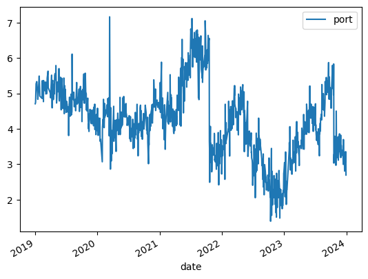

# 協整關係 Cointegration

在我的上一個實作中，我們探討時間序列的均值回歸性質。但在實際的市場中，我們很難找到一個資產有很好的均值回歸性，因此，在這方面的交易選擇受到了局限。幸好，就算有些走勢並沒有均值回歸的特性，但它與另一個資產的線性組合卻會是均值回歸序列。在這一篇的內容中，我將延續上一篇的理念，來探討如何從兩個或多個走勢組合出一個我們較有辦法預測的均值回歸序列。我們可以用兩種方法測試協整關係，一個是 CADF test，只適合測試兩個走勢有沒有協整，另一個 Johansen Test，可測試多個。


## 定義

協整關係的定義就是兩個以上沒有均值回歸特性的序列的線性組合卻產生了均值回歸的特質。我們來看看台灣股市中找的找不到案例。

在 Ernie Chan 的書本中，他說 ETF 是一個很好找到的協整關係的類股。因此，我從元大台灣50（0050）著手。因為台灣為高科技產業大國，我同時也選了富邦科技（0052）來探討他們有沒有協整關係。這裡我選擇使用2019年初-2023年底5年的每日收盤價。


```python
from fugle_marketdata import RestClient

client = RestClient(api_key = api_key.key) # api_key.key 填入你的富果 RestAPI 鑰匙（api_key = '你的鑰匙')
stock = client.stock

# Import Data from RestAPI
s50_19 = stock.historical.candles(**{"symbol": "0050",
                                  "from": "2019-01-01",
                                  "to": "2019-12-31",
                                  "fields": "close",
                                  'sort': 'asc'})
s50_20 = stock.historical.candles(**{"symbol": "0050",
                                  "from": "2020-01-01",
                                  "to": "2020-12-31",
                                  "fields": "close",
                                  'sort': 'asc'})
s50_21 = stock.historical.candles(**{"symbol": "0050",
                                  "from": "2021-01-01",
                                  "to": "2021-12-31",
                                  "fields": "close",
                                  'sort': 'asc'})
s50_22 = stock.historical.candles(**{"symbol": "0050",
                                  "from": "2022-01-01",
                                  "to": "2022-12-31",
                                  "fields": "close",
                                  'sort': 'asc'})
s50_23 = stock.historical.candles(**{"symbol": "0050",
                                  "from": "2023-01-01",
                                  "to": "2023-12-31",
                                  "fields": "close",
                                  'sort': 'asc'})

s52_19 = stock.historical.candles(**{"symbol": "0052",
                                  "from": "2019-01-01",
                                  "to": "2019-12-31",
                                  "fields": "close",
                                  'sort': 'asc'})
s52_20 = stock.historical.candles(**{"symbol": "0052",
                                  "from": "2020-01-01",
                                  "to": "2020-12-31",
                                  "fields": "close",
                                  'sort': 'asc'})
s52_21 = stock.historical.candles(**{"symbol": "0052",
                                  "from": "2021-01-01",
                                  "to": "2021-12-31",
                                  "fields": "close",
                                  'sort': 'asc'})
s52_22 = stock.historical.candles(**{"symbol": "0052",
                                  "from": "2022-01-01",
                                  "to": "2022-12-31",
                                  "fields": "close",
                                  'sort': 'asc'})
s52_23 = stock.historical.candles(**{"symbol": "0052",
                                  "from": "2023-01-01",
                                  "to": "2023-12-31",
                                  "fields": "close",
                                  'sort': 'asc'})
```

抓完資料，彙整成一個大 Dataframe


```python
# Consolidating Data
import pandas as pd

df50_19 = pd.DataFrame.from_dict(s50_19['data'])
df50_20 = pd.DataFrame.from_dict(s50_20['data'])
df50_21 = pd.DataFrame.from_dict(s50_21['data'])
df50_22 = pd.DataFrame.from_dict(s50_22['data'])
df50_23 = pd.DataFrame.from_dict(s50_23['data'])

df50 = pd.concat([df50_19, df50_20, df50_21, df50_22, df50_23], ignore_index=True)
df50['date'] = pd.to_datetime(df50['date'])
df50.set_index('date', inplace=True)
df50.rename(columns={'close':'0050'}, inplace=True)

df52_19 = pd.DataFrame.from_dict(s52_19['data'])
df52_20 = pd.DataFrame.from_dict(s52_20['data'])
df52_21 = pd.DataFrame.from_dict(s52_21['data'])
df52_22 = pd.DataFrame.from_dict(s52_22['data'])
df52_23 = pd.DataFrame.from_dict(s52_23['data'])

df52 = pd.concat([df52_19, df52_20, df52_21, df52_22, df52_23], ignore_index=True)
df52['date'] = pd.to_datetime(df52['date'])
df52.set_index('date', inplace=True)
df52.rename(columns={'close':'0052'}, inplace=True)

df = pd.merge(df50, df52, on='date')
```

我們可以用上個實作中學到的 ADF Test 驗證個別價格序列的均值回歸性質並不強。


```python
from statsmodels.tsa.stattools import adfuller
adfuller(df['0050'])
```


    (-1.5426129967181272,
     0.5123359516806487,
     0,
     1215,
     {'1%': -3.435743555099632,
      '5%': -2.8639217381867486,
      '10%': -2.568038075665972},
     4043.7349814625486)


```python
adfuller(df['0052'])
```


    (-1.45426790129448,
     0.5560010059811024,
     1,
     1214,
     {'1%': -3.4357480073434905,
      '5%': -2.863923702481129,
      '10%': -2.568039121778048},
     4191.173843446136)


再來觀察兩個放在一起的圖表


```python
df.plot()
```

    /Users/varltia/PycharmProjects/algo_trading/.venv/lib/python3.12/site-packages/pandas/plotting/_matplotlib/core.py:981: UserWarning: This axis already has a converter set and is updating to a potentially incompatible converter
      return ax.plot(*args, **kwds)


    <Axes: xlabel='date'>


    

    


可以觀察到兩個走勢型態挺像的，雖然有數值上的差異。接下來，可以更進一步用散佈圖看一下兩者價格的相關性。


```python
df.plot(x='0050', y='0052', style='o')
```


    <Axes: xlabel='0050'>


    

    


散佈圖上可以看到所有的點都落在一個粗略的線條上，價格之間是有視覺上的相關性。

## CADF Test

CADF test 與上一篇的 ADF Test 性質相同，只是在測試兩個序列之間有沒有協整關係。因為 python 的套件中沒有完整的 CADF 函式，我們得手動去做這個測驗。但它不難！需要使用的函式我們在上一篇實作中已經用過，就是普通最小回歸法（OLS）以及 ADF 測試。我們的目的就是要找到兩個走勢之間最好的避險比率然後使用這個避險比率組合出的資產組合價值去測驗他的的均值回歸性。最佳避險組合就是普通最小平方法算出來的回歸係數。若自變數是 $0052$，應變數是 $0050$，回歸係數算出來是 $a$，那我們會得到 $0050=a*0052+某常數+殘差$。那我們的資產組合價值的數列出來就會是 $0050-a*0052=某常數+殘差$ 的序列。


```python
import statsmodels.api as sm
# Regression

s52_wc = sm.add_constant(df['0052'])
model = sm.OLS(df['0050'], s52_wc)
results = model.fit()
print(results.params[1])
```

    0.800360575331253


    /var/folders/r8/c399k3cj0l59gk4_hz40yfy40000gn/T/ipykernel_2229/4226265877.py:7: FutureWarning: Series.__getitem__ treating keys as positions is deprecated. In a future version, integer keys will always be treated as labels (consistent with DataFrame behavior). To access a value by position, use `ser.iloc[pos]`
      print(results.params[1])


這就是我們要的數值 $a$。

$某常數+殘差$ 序列畫成圖表如下：


```python
df['residuals_ols'] = results.resid + results.params[0]
df.plot.line(y='residuals_ols')
```

    /var/folders/r8/c399k3cj0l59gk4_hz40yfy40000gn/T/ipykernel_2229/926972774.py:1: FutureWarning: Series.__getitem__ treating keys as positions is deprecated. In a future version, integer keys will always be treated as labels (consistent with DataFrame behavior). To access a value by position, use `ser.iloc[pos]`
      df['residuals_ols'] = results.resid + results.params[0]


    <Axes: xlabel='date'>


    

    


是不是感覺剛這個序列就比較可能有均值回歸性了？我們就來用 ADF 測試檢驗一下：


```python
adfuller(df['residuals_ols'])
```


    (-3.0162704046265896,
     0.033402634121361956,
     1,
     1214,
     {'1%': -3.4357480073434905,
      '5%': -2.863923702481129,
      '10%': -2.568039121778048},
     1990.7747748072247)


測試結果，我們可以以95%的信任程度拒絕虛無假設，這個序列有均值回歸的性質！元大台灣50（0050）與富邦科技（0052）有協整關係。

## Johansen Test

相對於CADF test，Johansen Test 可以測試出十二個以內的時間序列的協整關係。對於測試大於兩個序列的協整關係的時候，這是一個比較方便的方式。[他的說明文件在這裡。](https://www.statsmodels.org/dev/generated/statsmodels.tsa.vector_ar.vecm.coint_johansen.html#statsmodels.tsa.vector_ar.vecm.coint_johansen-returns)這次我們來用元大台灣50（0050），元大MSCI台灣（006203），以及永豐台灣加權（006204）來測試三者之間的協整關係。


```python
s6203_19 = stock.historical.candles(**{"symbol": "006203",
                                  "from": "2019-01-01",
                                  "to": "2019-12-31",
                                  "fields": "close",
                                  'sort': 'asc'})
s6203_20 = stock.historical.candles(**{"symbol": "006203",
                                  "from": "2020-01-01",
                                  "to": "2020-12-31",
                                  "fields": "close",
                                  'sort': 'asc'})
s6203_21 = stock.historical.candles(**{"symbol": "006203",
                                  "from": "2021-01-01",
                                  "to": "2021-12-31",
                                  "fields": "close",
                                  'sort': 'asc'})
s6203_22 = stock.historical.candles(**{"symbol": "006203",
                                  "from": "2022-01-01",
                                  "to": "2022-12-31",
                                  "fields": "close",
                                  'sort': 'asc'})
s6203_23 = stock.historical.candles(**{"symbol": "006203",
                                  "from": "2023-01-01",
                                  "to": "2023-12-31",
                                  "fields": "close",
                                  'sort': 'asc'})

s6204_19 = stock.historical.candles(**{"symbol": "006204",
                                  "from": "2019-01-01",
                                  "to": "2019-12-31",
                                  "fields": "close",
                                  'sort': 'asc'})
s6204_20 = stock.historical.candles(**{"symbol": "006204",
                                  "from": "2020-01-01",
                                  "to": "2020-12-31",
                                  "fields": "close",
                                  'sort': 'asc'})
s6204_21 = stock.historical.candles(**{"symbol": "006204",
                                  "from": "2021-01-01",
                                  "to": "2021-12-31",
                                  "fields": "close",
                                  'sort': 'asc'})
s6204_22 = stock.historical.candles(**{"symbol": "006204",
                                  "from": "2022-01-01",
                                  "to": "2022-12-31",
                                  "fields": "close",
                                  'sort': 'asc'})
s6204_23 = stock.historical.candles(**{"symbol": "006204",
                                  "from": "2023-01-01",
                                  "to": "2023-12-31",
                                  "fields": "close",
                                  'sort': 'asc'})

df6203_19 = pd.DataFrame.from_dict(s6203_19['data'])
df6203_20 = pd.DataFrame.from_dict(s6203_20['data'])
df6203_21 = pd.DataFrame.from_dict(s6203_21['data'])
df6203_22 = pd.DataFrame.from_dict(s6203_22['data'])
df6203_23 = pd.DataFrame.from_dict(s6203_23['data'])

df6203 = pd.concat([df6203_19, df6203_20, df6203_21, df6203_22, df6203_23], ignore_index=True)
df6203['date'] = pd.to_datetime(df6203['date'])
df6203.set_index('date', inplace=True)
df6203.rename(columns={'close':'006203'}, inplace=True)

df6204_19 = pd.DataFrame.from_dict(s6204_19['data'])
df6204_20 = pd.DataFrame.from_dict(s6204_20['data'])
df6204_21 = pd.DataFrame.from_dict(s6204_21['data'])
df6204_22 = pd.DataFrame.from_dict(s6204_22['data'])
df6204_23 = pd.DataFrame.from_dict(s6204_23['data'])

df6204 = pd.concat([df6204_19, df6204_20, df6204_21, df6204_22, df6204_23], ignore_index=True)
df6204['date'] = pd.to_datetime(df6204['date'])
df6204.set_index('date', inplace=True)
df6204.rename(columns={'close':'006204'}, inplace=True)

df = pd.merge(df50, df6203, how='inner', on='date')
df = pd.merge(df, df6204, how='inner', on='date')
```

三個走勢圖表如下：


```python
df.plot()
```

    /Users/varltia/PycharmProjects/algo_trading/.venv/lib/python3.12/site-packages/pandas/plotting/_matplotlib/core.py:981: UserWarning: This axis already has a converter set and is updating to a potentially incompatible converter
      return ax.plot(*args, **kwds)
    /Users/varltia/PycharmProjects/algo_trading/.venv/lib/python3.12/site-packages/pandas/plotting/_matplotlib/core.py:981: UserWarning: This axis already has a converter set and is updating to a potentially incompatible converter
      return ax.plot(*args, **kwds)


    <Axes: xlabel='date'>


    

    


接下來就是 Johansen test 的部分，第一個參數就是價格的 Dataframe ，第二個我們會用0代表允許常數但不允許固定趨勢，第三個用1代表一個延遲差。


```python
from statsmodels.tsa.vector_ar.vecm import coint_johansen
import numpy as np

results_johansen = coint_johansen(df, 0, 1)
```


Johansen test 結果分為兩個部分，第一個為跡（Trace）的測驗，第二個為特徵值（Eigenvalue）的部分。我們先來看跡的測驗結果。


```python
print(results_johansen.trace_stat)
print(results_johansen.trace_stat_crit_vals)
```

    [38.88703788 13.15091991  3.90923045]
    [[27.0669 29.7961 35.4628]
     [13.4294 15.4943 19.9349]
     [ 2.7055  3.8415  6.6349]]


設這三個序列中有 $r$ 個協整關係。
第一行為跡的三個測驗值，下面的矩陣為對應測驗值的顯著性門檻（90%，95%，99%）。矩陣的第一行的虛無假設為 $r\le0$，因為我們的測驗值38.88大於35.46，這代表我們可以以99%的信心拒絕掉虛無假設，此三個序列中存在著大於零個協整關係。矩陣的第二行的虛無假設為 $r\le1$，因為我們的測驗值13.15大於13.42，這代表我們可以以90%的信心拒絕掉虛無假設，此三個序列中存在著大於一個協整關係。矩陣的第三行的虛無假設為 $r\le2$，因為我們的測驗值3.90大於3.84，這代表我們可以以95%的信心拒絕掉虛無假設，此三個序列中存在著大於兩個個協整關係。總體來說，我們可以以95%的信心說此三個序列之間有三個協整關係，因此三個中間都有共同協整的跡象。


```python
print(results_johansen.max_eig_stat)
print(results_johansen.max_eig_stat_crit_vals)
```

    [25.73611797  9.24168946  3.90923045]
    [[18.8928 21.1314 25.865 ]
     [12.2971 14.2639 18.52  ]
     [ 2.7055  3.8415  6.6349]]


特徵值的輸出結果也是用同樣的方式解讀。第一行為特徵值的三個測驗值，下面的矩陣為對應測驗值的顯著性門檻（90%，95%，99%）。矩陣的第一行的虛無假設為 $r\le0$，因為我們的測驗值25.73大於21.13，這代表我們可以以95%的信心拒絕掉虛無假設，此三個序列中存在著大於零個協整關係。矩陣的第二行的虛無假設為 $r\le1$，因為我們的測驗值9.24不大於12.29，這代表我們無法以90%的信心拒絕掉虛無假設。矩陣的第三行的虛無假設為 $r\le2$，因為我們的測驗值3.90大於3.84，這代表我們可以以95%的信心拒絕掉虛無假設，此三個序列中存在著大於兩個個協整關係。總體來說，我們可以以95%的信心說此三個序列之間有三個協整關係，因此三個中間都有共同協整的跡象。

跡與特徵值的測驗結果都告訴我們，我們可以以95%的信心肯定這三個序列是有互相協整的關係。我們可以從這三個序列的線性組合中得到一個有均值回歸特性的資產組合。那這個資產組合比例是什麼呢？


```python
print(results_johansen.eig)
print(results_johansen.evec)
```

    [0.02335573 0.00845049 0.00358331]
    [[ 0.66903517 -0.30296701 -0.0075217 ]
     [-1.93519971  0.23419079 -0.05495377]
     [ 0.44947395  0.28651951 -0.02014907]]


從測驗結果中取得特徵值以及特徵向量（Eigenvector）。特徵值會從大到小排列，對應到的特徵向量是矩陣中的列。特徵數越大代表協整性越強，因此我們是用的資產組合應為特徵值0.02對應到的［0.66 -1.93 0.44］矩陣第一列。這代表是我們手中持有的0050，006203，006204的最佳比例為 $0.66:-1.93:0.44$。

我們這就來看這樣的資產組合序列會長什麼樣子。


```python
df['port'] = 0.66903517*df['0050'] - 1.93519971*df['006203'] + 0.44947395*df['006204']
df.plot.line(y='port')
```


    <Axes: xlabel='date'>


    

    


```python
adfuller(df['port'])
```


    (-2.655242469718872,
     0.08210861433488909,
     6,
     1084,
     {'1%': -3.436396912213269,
      '5%': -2.864209963080287,
      '10%': -2.5681915787162484},
     1168.616493440217)


用ADF測試他的均值回歸性，也可以以90%的信任確認這個投資組合從2019年初到2023年底的均值回歸性。

如上一篇，我們來算算他的均值回歸半衰期。


```python
port = df['port'].tolist()
d_port = np.diff(port)
port_wc = sm.add_constant(port[:-1])
model = sm.OLS(d_port, port_wc)
results = model.fit()
halflife = -np.log(2)/results.params[1]
print(halflife)
```

    6.209679590380347


有了這個結果，我們就來嘗試用這個策略再做出和上一篇文章類似的回測。但不一樣的是，我用2019-2023的結果在2024做回測，因此去除掉前瞻性偏差。策略的內容是一樣的，試圖持有每日價格經過移動平均標準化常態化後之偏差的負股份。


```python
s50_24 = stock.historical.candles(**{"symbol": "0050",
                                  "from": "2024-01-01",
                                  "to": "2024-12-10",
                                  "fields": "close",
                                  'sort': 'asc'})
s6203_24 = stock.historical.candles(**{"symbol": "006203",
                                  "from": "2024-01-01",
                                  "to": "2024-12-10",
                                  "fields": "close",
                                  'sort': 'asc'})
s6204_24 = stock.historical.candles(**{"symbol": "006204",
                                  "from": "2024-01-01",
                                  "to": "2024-12-10",
                                  "fields": "close",
                                  'sort': 'asc'})

df50_24 = pd.DataFrame.from_dict(s50_24['data'])
df50_24['date'] = pd.to_datetime(df50_24['date'])
df50_24.set_index('date', inplace=True)
df50_24.rename(columns={'close':'0050'}, inplace=True)

df6203_24 = pd.DataFrame.from_dict(s6203_24['data'])
df6203_24['date'] = pd.to_datetime(df6203_24['date'])
df6203_24.set_index('date', inplace=True)
df6203_24.rename(columns={'close':'006203'}, inplace=True)

df6204_24 = pd.DataFrame.from_dict(s6204_24['data'])
df6204_24['date'] = pd.to_datetime(df6204_24['date'])
df6204_24.set_index('date', inplace=True)
df6204_24.rename(columns={'close':'006204'}, inplace=True)

df24 = pd.merge(df50_24, df6203_24, how='inner', on='date')
df24 = pd.merge(df24, df6204_24, how='inner', on='date')
```

走勢圖如下：


```python
df24.plot()
```

    /Users/varltia/PycharmProjects/algo_trading/.venv/lib/python3.12/site-packages/pandas/plotting/_matplotlib/core.py:981: UserWarning: This axis already has a converter set and is updating to a potentially incompatible converter
      return ax.plot(*args, **kwds)
    /Users/varltia/PycharmProjects/algo_trading/.venv/lib/python3.12/site-packages/pandas/plotting/_matplotlib/core.py:981: UserWarning: This axis already has a converter set and is updating to a potentially incompatible converter
      return ax.plot(*args, **kwds)


    <Axes: xlabel='date'>


    

    


用 Johansen Test 的資產組合比例組合出來的走勢如下：


```python
df24['port'] = 0.66903517*df24['0050'] -1.93519971*df24['006203'] +0.44947395*df24['006204']
df24.plot.line(y='port')
```


    <Axes: xlabel='date'>


    

    


即使使用來建立模型的資料是來自2019-2023年，我們在2024年得到的資產組合走勢也看起來很有均值回歸性！我們回測的結果收益如下：


```python
window = round(halflife)
df24['mva'] = df24['port'].rolling(window).mean()
df24['msd'] = df24['port'].rolling(window).std()
df24['mktval'] = (-(df24['port'] - df24['mva'])/df24['msd'])*df24['port']
df24['pnl'] = df24['mktval'].shift(1) * (df24['port']-df24['port'].shift(1)) / df24['port'].shift(1)
df24['cumpnl'] = df24['pnl'].cumsum()
df24['cumpnl'].plot(kind='line', color='red')
```


    <Axes: xlabel='date'>


    

    


我們可以看到此回測結果表現不錯，也沒有很長的回撤期。同時，我們去除了上一篇文章類似策略裡的前瞻性偏差後，策略依然還是很有效。可以說協整關係的均值回歸資產組合產物理論上是有利可圖的，但我們仍然有交易手續費以及部位調整單位限制等實際操作下的問題。希望在未來的文章裡，可以針對這一些問題繼續做討論。

希望本文對於各位前輩有幫助！

FJ
